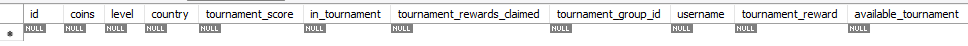
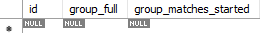

# Dream Games - Case Study
Using Rest API with Spring Boot as a game's backend service this project demonstrates the implementation of a gaming tournament system with user management, leaderboard tracking, and scheduled tournament events.
I have created a design in which, whenever there is a tournament available (00:00 - 20:00 UTC) and a user who meets the criteria wants to join the tournament then a tournament group is created if there is not any available. The groups are structured so for the matching to begin, they need to be full of users from different countries. If a user from Germany joins the tournament and there is a tournament group which already has a user from Germany then a new tournament group is created. All users who join the tournament search for an available group they can fill, and only if there is none another tournament group is created. My application's main functionalities and the project's most focused part is the TournamentService, by inspection it will be clear how I handle ending the tournament operations.
## The project consist of several components:

### Models:
- User
- TournamentGroup
- CountryLeaderboardEntry
- LeaderboardEntry

### Repositories:
- UserRepository
- TournamentGroupRepository

### Services:
- UserService
- TournamentService
- CountryLeaderboardService
- LeaderboardService

### Controllers:
- UserController
- TournamentController
- LeaderboardController

## Entity-Repository-Service Structure
The application follows a clear separation with entities representing data models, repositories managing data access, and services encapsulating business logic. This separation enhances modularity and testability.

As the shared document was self-explanatory and easy to navigate, the projects requirements were clear after sketching few ideas on the notebook for the model designs. 

### Unit Tests
- Each service has its own test class in "src/test/java/com/example/game" and they are thoroughly tested with successful results.
- The only thing that is not covered is the _**country leader board**_ as the document states the users' countries are randomized and final when they are created, I could not find a way to create instances where I could test successfully.

# MYSQL Structure
## Create user Table:

CREATE TABLE `user` (
`id` int NOT NULL AUTO_INCREMENT,
`coins` int NOT NULL,
`level` int NOT NULL,
`country` varchar(255) COLLATE utf8mb3_bin NOT NULL,
`tournament_score` int DEFAULT '0',
`in_tournament` tinyint(1) DEFAULT '0',
`tournament_rewards_claimed` tinyint(1) DEFAULT '1',
`tournament_group_id` int DEFAULT NULL,
`username` varchar(255) COLLATE utf8mb3_bin NOT NULL,
`tournament_reward` int DEFAULT '0',
`available_tournament` tinyint(1) DEFAULT '1',
PRIMARY KEY (`id`),
UNIQUE KEY `id` (`id`)
) ENGINE=InnoDB DEFAULT CHARSET=utf8mb3 COLLATE=utf8mb3_bin;

## Create tournament_group Table:

CREATE TABLE `tournament_group` (
`id` bigint NOT NULL AUTO_INCREMENT,
`group_full` tinyint(1) DEFAULT NULL,
`group_matches_started` tinyint(1) DEFAULT NULL,
PRIMARY KEY (`id`),
UNIQUE KEY `id` (`id`)
) ENGINE=InnoDB DEFAULT CHARSET=utf8mb3 COLLATE=utf8mb3_bin;

# Postman Requests:
- (**POST**) Create User: http://localhost:8080/api/users/create/{{$randomUserName}}
- (**POST**) Update Level: http://localhost:8080/api/users/updateLevel/userId
- (**POST**) Enter Tournament: http://localhost:8080/api/tournament/enter/userId
- (**POST**) Claim Reward: http://localhost:8080/api/tournament/claimReward/userId
- (**GET**) Group Leaderboard: http://localhost:8080/api/leaderboard/group/groupId
- (**GET**) Group Rank: http://localhost:8080/api/users/getGroupRank/userId
- (**GET**) Country Leaderboard: http://localhost:8080/api/leaderboard/country
